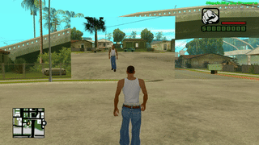

# mirror

[](https://github.com/MrCreepTon/mirror/actions/workflows/build.yml)
[](https://github.com/MrCreepTon/mirror/releases/latest)
[](https://github.com/MrCreepTon/mirror/releases)
-2C2D72?logo=lua&logoColor=white)


Library for [Moonloader](https://www.blast.hk/threads/13305/), allows to use multiple cameras in GTA: San Andreas. Output from cameras can be rendered on screen or in 3D space.



## Features

- Multiple cameras with any position, rotation, FOV
- **2D-screens** — outputs image from camera on your screen
- **3D-screens** — outputs image from camera in 3D space
- All camera and screen parameters can be changed in real time from Lua
- Automatic resource cleanup when a script is unloaded

## Requirements

- GTA: San Andreas 1.0 (US)
- Moonloader

## Installation

1. Download archive from [last release](https://github.com/MrCreepTon/mirror/releases/latest).
2. Unpack `mirror_core.dll` and `mirror.lua` in `<GTA SA Folder>/moonloader/lib/`.

## Quick start

```lua
local mirror = require('mirror')

function main()
    -- Camera 640x480: in world position, rotation in degrees, FOV 70
    local cam = mirror.createCamera(640, 480, 32, 2495.0, -1668.0, 15.0, 0.0, 0.0, 180.0, 70.0)

    -- Output image to rectangle in top left corner of the screen
    local screen = mirror.createScreen2D(20.0, 20.0, 340.0, 260.0, cam)

    while true do
        wait(0)
        cam.rotZ = cam.rotZ + 0.5 -- slow camera rotation
    end
end
```

3D screen example:

```lua
local screen3d = mirror.createScreen3D(
    2490.0, -1660.0, 13.0,  -- left bottom corner
    2494.0, -1660.0, 13.0,  -- right bottom corner
    2490.0, -1660.0, 16.0,  -- left up corner
    2494.0, -1660.0, 16.0,  -- right up corner
    cam
)
```

## Examples

Complete scripts are in the [examples](examples/) folder:

| Example | Command | Description |
|---|---|---|
| [back](examples/back/) | `/back` | Rear-view mirror in a corner of the screen |
| [drone](examples/drone/) | `/drone` | Flying FPV drone with a live camera feed |
| [spy](examples/spy/) | `/spy <id>` | Surveillance camera that follows another player's point of view |
| [tv](examples/tv/) | `/tv` | 3D screen in the world showing a live feed of yourself |

## API

### Functions

| Function | Returns | Description |
|---|---|---|
| `mirror.createCamera(width, height, depth[, posX, posY, posZ, rotX, rotY, rotZ, fov])` | `Camera` | Creates a camera rendering the world into a `width`×`height` texture (`depth` is the bit depth, use `32`). Position defaults to `0, 0, 0`, rotation to `0`, `fov` to `90`. |
| `mirror.createScreen2D(left, top, right, bottom[, camera])` | `Screen2D` | Creates a rectangle on the screen (coordinates in pixels) that displays the camera image. |
| `mirror.createScreen3D(lbX, lbY, lbZ, rbX, rbY, rbZ, ltX, ltY, ltZ, rtX, rtY, rtZ[, camera])` | `Screen3D` | Creates a quad in the game world defined by four corners (left-bottom, right-bottom, left-top, right-top; world coordinates). Not rendered until a camera is attached. |
| `mirror.unload()` | — | Destroys all cameras and screens created by the current script. Called automatically when the script terminates, no need to call it manually. |

### Objects

All fields can be read and changed at any time — the picture updates on the next frame.

#### Camera

A camera rendering the world into its own texture.

| Member | Description |
|--------|-------------|
| `posX`, `posY`, `posZ` | Position in the world |
| `rotX`, `rotY`, `rotZ` | Rotation in degrees |
| `fov` | Field of view in degrees |
| `:delete()` | Destroys the camera and frees its textures |

#### Screen2D

A rectangle drawn on top of the game screen.

| Member | Description |
|--------|-------------|
| `left`, `top`, `right`, `bottom` | Screen rectangle in pixels |
| `pCamera` | Attached camera; can be reassigned at any time |
| `:delete()` | Destroys the screen |

#### Screen3D

A quad placed in the game world.

| Member | Description |
|--------|-------------|
| `leftBottom`, `rightBottom`, `leftTop`, `rightTop` | Corner positions in the world; each has `x`, `y`, `z` fields |
| `pCamera` | Attached camera; can be reassigned at any time |
| `:delete()` | Destroys the screen |

## Building from source

Requires Visual Studio 2022 (C++ x86 components) and CMake 3.21+. Dependencies: MinHook is fetched automatically via FetchContent, LuaJIT (`lua51.lib`) and sol2 are bundled in the repository.

```powershell
cmake --preset win32
cmake --build --preset release
```

The built DLL is `build/bin/mirror_core.dll`.

To automatically copy the DLL and `mirror.lua` into the game after every build, create `CMakeUserPresets.json`:

```json
{
  "version": 3,
  "configurePresets": [
    {
      "name": "my",
      "inherits": "win32",
      "cacheVariables": {
        "MIRROR_DEPLOY_DIR": "C:/Games/GTASA/moonloader/lib"
      }
    }
  ]
}
```

and build with `cmake --preset my`.

## Project structure

```
src/       — DLL sources (C++17, render hooks and Lua bindings)
lua/       — Lua wrapper for the module
examples/  — example scripts
include/   — LuaJIT and sol2 headers
lib/       — lua51.lib (LuaJIT import library)
```

## Releases

Every push is built by CI (Actions tab, artifact `mirror`). A release is created by pushing a `v*` tag — CI builds the module and publishes a draft release with the archive.
