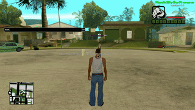

# back.lua

Type `/back` to toggle a rear-view display in the corner of the screen. Every frame the mirror camera is placed at the position of the active game camera and rotated to look backwards, so the display always shows what is behind you.

## Usage

`/back` — toggle the rear-view display on/off