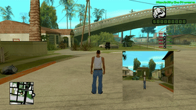

# drone.lua

Type `/drone` to spawn a flying drone next to you with an onboard camera. The camera feed is displayed in a screen overlay, so you can fly the drone around and see the world from its point of view.

## Usage

`/drone` — spawn/remove the drone

| Key | Action |
|---|---|
| Numpad 8 / 2 | Fly forward / backward |
| Numpad 4 / 6 | Turn |
| Numpad 9 / 3 | Fly up / down |