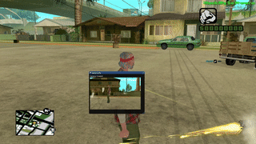

# dx9_mimgui_integration.lua

Displays a camera feed inside a mimgui (Dear ImGui) window. The camera's `frameBuffer`.

## Usage

| Command | Description |
|---|---|
| `/mi_camera` | Spawns/removes a full-screen camera at your position |
| `/mi_menu` | Toggles an ImGui window showing the live camera feed |
