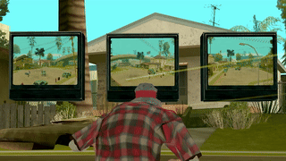

# object_screen.lua

Demonstrates binding a camera's frame buffer directly onto the material of a object. It reads the camera's `frameBuffer` (the raw `RwRaster*`), wraps it into an `RwTexture` and swaps it into the object's `CJ_TV_SCREEN` material during rendering — so any object using that material (for example the model `1518` TV screen spawned by this script) displays the live camera feed.

## Usage

| Command | Description |
|---|---|
| `/os camera create` | Spawns a camera at your position and prints its index |
| `/os camera remove <index>` | Removes the camera with the given index |
| `/os screen create` | Spawns a `CJ_TV_SCREEN` object at your position and prints its index |
| `/os screen remove <index>` | Removes the object with the given index |
| `/os screen link <screen_index> <camera_index>` | Binds the camera's feed onto the screen object's material |
