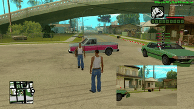

# spy.lua

Type `/spy <playerid>` to watch another player: a camera is attached to the target player's head and oriented along their view direction, so you see roughly what they are looking at. The view direction is taken from SA-MP aim sync packets (`onAimSync`) and smoothly interpolated between updates.

Aim interpetation was taken from [Cosmo script](https://www.blast.hk/threads/128348/post-1011459):  

## Usage

- `/spy <playerid>` — start watching the player
- `/spy` (while active) — stop watching

The camera turns off automatically if the target player streams out or disconnects.